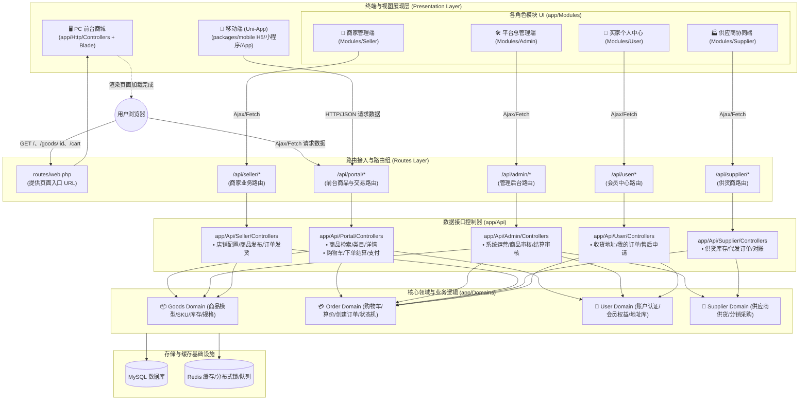
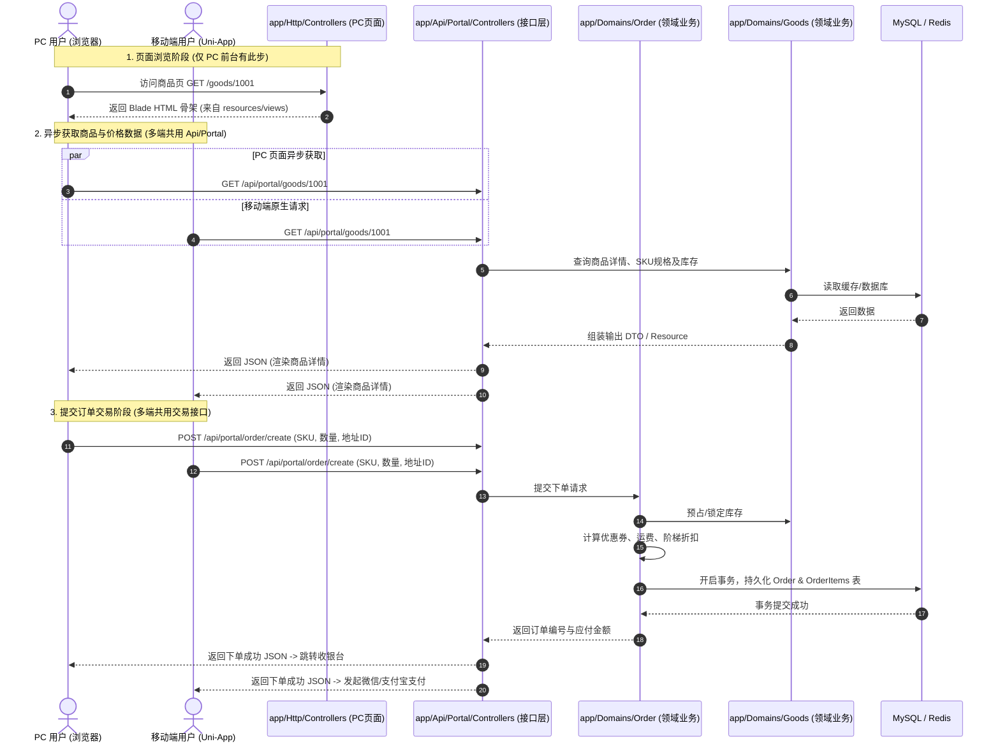

# 系统架构与全端数据流向设计规范 (Architecture & Data Flow)

> **版本**：v1.0  
> **更新时间**：2026-09-30  
> **状态**：已审定（作为项目前台与各模块开发基准）

---

## 1. 架构全景与核心设计原则

本项目采用 **多端接入 + 统一领域模型 (Domain-Driven Design) + 前后端清晰分层** 的架构体系：

```
┌────────────────────────────────────────────────────────────────────────┐
│                        终端展现层 (UI / View)                          │
├──────────────────┬───────────────────────┬─────────────────────────────┤
│   PC 前台商城    │   移动多端 (Uni-App)  │    用户与运营模块 UI 视图   │
│app/Modules/Portal│    packages/mobile    │         app/Modules         │
│  (Blade 页面)    │  (H5/小程序/App)      │ Admin / Seller / Supplier / │
│                  │                       │      User (Blade 视图)      │
└─────────┬────────┴───────────┬───────────┴──────────────┬──────────────┘
          │ (Ajax/Fetch)       │ (HTTP REST)              │ (Ajax/Fetch)
          ▼                    ▼                          ▼
┌────────────────────────────────────────────────────────────────────────┐
│                    API 接口接入层 (app/Api/*)                          │
├──────────────────────────────────────────┬─────────────────────────────┤
│         前台公共与交易接口               │      各角色管理业务接口     │
│           app/Api/Portal                 │  app/Api/{Admin,Seller,     │
│   (PC 前台与移动端多端统一复用)          │       Supplier,User}        │
└─────────────────────────────┬────────────┴──────────────┬──────────────┘
                              │                           │
                              ▼                           ▼
┌────────────────────────────────────────────────────────────────────────┐
│                    核心领域业务层 (app/Domains)                        │
│    Goods(商品)  /  Order(订单交易)  /  Cart(购物车)  /  User(会员)      │
│  ┌──────────────────────────────────────────────────────────────────┐  │
│  │ 业务规则闭环：库存校验扣减、阶梯定价、下单结算、状态机流转等       │  │
│  └──────────────────────────────────────────────────────────────────┘  │
└─────────────────────────────┬──────────────────────────────────────────┘
                              │
                              ▼
┌────────────────────────────────────────────────────────────────────────┐
│                数据存储与基础设施 (Storage / Infra)                    │
│                     MySQL 8.0  /  Redis 缓存与队列                     │
└────────────────────────────────────────────────────────────────────────┘
```

### 核心设计原则

1. **多端复用 API 资产**：
   - `packages/mobile`（Uni-App 移动端）与 PC 前台商城的页面异步交互，**共同调用 `app/Api/Portal`** 提供的 RESTful 接口，杜绝重复开发业务逻辑。
2. **UI 视图与数据解耦**：
   - PC 前台（`app/Http/Controllers`）与各类用户模块（`app/Modules`）统一采用 **Blade 模板引擎** 渲染页面骨架，页面加载完成后通过 **浏览器端 Ajax/Fetch** 消费各自的 `app/Api` 接口。
3. **领域业务防腐（Domain-Driven）**：
   - 所有 Controller（无论是 Web 页面控制器还是 Api 数据控制器）均作为**薄控制器（Thin Controller）**，仅负责接收参数校验与格式化输出。
   - 核心交易计算、订单状态扭转、库存扣减、分润对账等业务逻辑**严格封装在 `app/Domains` 中**。

---

## 2. 详细数据流向图

### 2.1 全景数据拓扑流向图



---

### 2.2 典型交易时序图（前台浏览 -> 下单 -> 支付）

展示 PC 端与移动端如何统一复用 `app/Api/Portal` 与 `app/Domains`：



---

## 3. 模块职责与目录映射规范

| 模块定位 | 对应代码路径 | 主要职责与规范 | 数据交互目标 |
| :--- | :--- | :--- | :--- |
| **PC 前台页面** | `app/Modules/Portal/` | 负责前台商城页面的 HTTP 入口与 Blade 视图（`Views/`），路由位于 `Routes/route.php` | 页面内前端 Ajax 访问 `app/Api/Portal` |
| **移动多端** | `packages/mobile/` | Uni-App Vue3 移动端工程，构建 H5、微信小程序与移动 App | HTTP 请求 `app/Api/Portal` |
| **各角色模块 UI** | `app/Modules/{Module}/` | 包含 `Portal`, `Admin`, `Seller`, `Supplier`, `User` 模块的控制器与 UI 骨架视图 | 页面内前端 Ajax 访问对应 `app/Api/{Module}` |
| **数据接口 API** | `app/Api/{Module}/` | 统一 RESTful API 控制器与路由定义，提供标准化 JSON 响应 | 调用 `app/Domains` 业务服务 |
| **业务领域模型** | `app/Domains/{Domain}/` | 沉淀高内聚的业务逻辑、模型实体、状态机、仓储接口与计算规则 | 读写 MySQL 与 Redis |

---

## 4. 工程落地与编码军规 (Engineering Conventions)

### 4.1 迁移文件按领域组织与表/字段注释规范
- **规则**：
  1. 严禁按单表无节制新建 migration 文件。必须**按领域（如 Goods、Trade、User、Supplier）集中创建与维护迁移文件**（例如 `create_goods_domain_tables.php`、`create_trade_domain_tables.php`）。
  2. **Schema 必须包含简洁清晰的表注释**：每个表的迁移定义中必须显式声明 `$table->comment('XXX表');`（例如 `users` 表标注“用户表”、`orders` 表标注“订单表”、`carts` 表标注“购物车表”）。
  3. **字段注释与枚举字段格式规范**：所有字段必须带有简洁的 comment 信息。若为状态或类型枚举字段，描述信息必须严格统一使用形如：**`状态：1-启用，2-不启用`** 格式（格式：`描述：值1-标签1，值2-标签2`，使用冒号与破折号、逗号隔开），以供 `php artisan gen:enum` 工具精准解析并自动生成对应的 PHP Enum 类。
- **目的**：杜绝 `database/migrations` 随着表数增多而产生上百个碎片文件的无限膨胀；同时保障代码生成器（`php artisan gen:xxx`）及数据库字典工具能够精准提取表业务语义与枚举映射，自动生成规范的代码命名与枚举类。

### 4.2 服务层 (app/Services) 与领域生成代码防腐隔离
- **规则**：
  1. 通过 `php artisan gen:xxx`（DevTools）生成的 `app/Domains/{Domain}/` 基础代码（Model, Entity, Dao/Repository, Service, Request, Response）作为基底资产，**原则上严禁手工侵入修改**。
  2. 复杂的跨表组装、跨领域协同、业务计算等应用层服务，统一在 **`app/Services/{Domain}/`** 中按领域创建，通过继承或依赖注入（DI）消费 `app/Domains/{Domain}/Services`。
- **目的**：代码生成器后续重新执行或覆盖时，不会抹掉应用层手工编写的核心业务代码。

### 4.3 数据接口按业务实体控制器聚合
- **规则**：严禁为每个 API 动作单独创建单动作控制器（Single Action Controller）。相关联的业务动作必须统一聚合在一个控制器中（例如：商品列表 `search`、商品详情 `show`、商品分类 `categories` 统一在 `GoodsController` 中）。
- **目的**：保持路由配置清晰紧凑，控制器职责聚合，大幅度降低文件维护成本。

### 4.4 接口文档 OpenAPI 注解与 DTO 规范
- **规则**：
  1. 所有 API 控制器方法必须采用 PHP 8 原生属性 `#[OA\...]`（OpenApi\Attributes）标准注解，声明请求方式、路径、入参、请求体 Schema 与响应结构。
  2. 请求入参 DTO 与响应出参 DTO **严禁使用任意无约束的数组**，必须分别在对应模块的 `Requests/` 与 `Responses/` 目录中单独定义，配合注解实现强类型契约。

### 4.5 模块视图与路由就近定义原则
- **规则**：`app/Modules/{Portal,Admin,Seller,Supplier,User}` 各模块的 Blade 视图统一就近存放在 `app/Modules/{Module}/Views/` 目录中，Web 路由统一定义在 `app/Modules/{Module}/Routes/route.php`。
- **服务提供者注册**：在全局服务提供者中自动扫描 `app/Modules/*/Views`，通过 `loadViewsFrom($viewsPath, $moduleName)` 进行视图命名空间注入；在控制器中使用 `view('{module}::xxx')` 进行视图渲染。

### 4.6 Modules 控制器 OpenAPI 注解与 gen:route 自动化路由规范
- **规则**：
  1. `app/Modules/{Portal,Admin,Seller,Supplier,User}` 下的所有控制器公共方法，必须在其首个 Attribute 位置标注标准 OpenAPI HTTP 动词注解（例如 `#[OA\Get(path: '...', summary: '...')]` 或 `#[OA\Post(path: '...', summary: '...')]`）。
  2. 必须严格声明 `path` 与 `summary` 两个命名参数。`path` 为相对于模块根路径的路由路径（如 `path: '/goods'`），`summary` 为该页面或动作的中文简述。
  3. 路由由命令行工具 `php artisan gen:route` 统一自动化扫描并生成至对应模块的 `Routes/route.gen.php` 中。
  4. 各模块的主路由入口 `Routes/route.php` 必须严格遵循轻量化原则，仅负责通过命名空间分组引入生成的路由文件（如 `Route::name('{module}.')->group(function () { require __DIR__.'/route.gen.php'; });`），杜绝手工散落定义路由。

### 4.7 任务完成收尾三部曲自动化执行规范
- **规则**：每次编码或重构任务完成准备向用户交付前，必须在项目根目录下按序自动执行以下三条命令：
  ```bash
  php artisan gen:route
  php artisan optimize
  vendor\bin\pint.bat app
  ```
- **目的**：
  1. 确保新增或修改的模块控制器路由定义即时同步至 `route.gen.php`；
  2. 编译并刷新框架配置、路由与事件缓存，验证无语法或依赖死锁异常；
  3. 统一代码规范格式化，保持代码库整洁一致。


