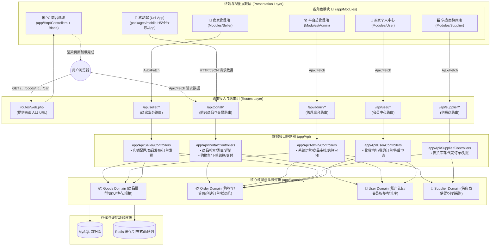
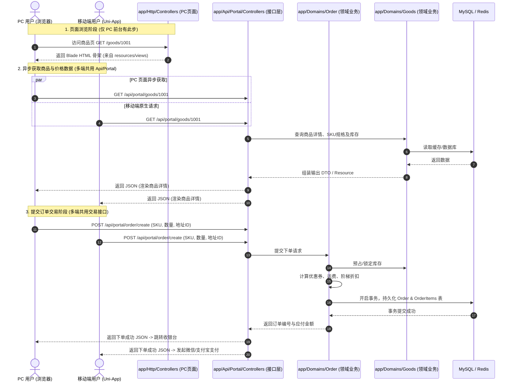

# 系统架构与全端数据流向设计规范 (Architecture & Data Flow)

> **版本**：v1.0  
> **更新时间**：2026-09-30  
> **状态**：已审定（作为项目前台与各模块开发基准）

---

## 1. 架构全景与核心设计原则

本项目采用 **多端接入 + 统一领域模型 (Domain-Driven Design) + 前后端清晰分层** 的架构体系：

```
┌────────────────────────────────────────────────────────────────────────┐
│                        终端展现层 (UI / View)                          │
├──────────────────┬───────────────────────┬─────────────────────────────┤
│   PC 前台商城    │   移动多端 (Uni-App)  │    四大用户模块 UI 视图     │
│ Http/Controllers │    packages/mobile    │         app/Modules         │
│  (Blade 页面)    │  (H5/小程序/App)      │ Admin / Seller / Supplier / │
│                  │                       │      User (Blade 视图)      │
└─────────┬────────┴───────────┬───────────┴──────────────┬──────────────┘
          │ (Ajax/Fetch)       │ (HTTP REST)              │ (Ajax/Fetch)
          ▼                    ▼                          ▼
┌────────────────────────────────────────────────────────────────────────┐
│                    API 接口接入层 (app/Api/*)                          │
├──────────────────────────────────────────┬─────────────────────────────┤
│         前台公共与交易接口               │      各角色管理业务接口     │
│           app/Api/Portal                 │  app/Api/{Admin,Seller,     │
│   (PC 前台与移动端多端统一复用)          │       Supplier,User}        │
└─────────────────────────────┬────────────┴──────────────┬──────────────┘
                              │                           │
                              ▼                           ▼
┌────────────────────────────────────────────────────────────────────────┐
│                    核心领域业务层 (app/Domains)                        │
│    Goods(商品)  /  Order(订单交易)  /  Cart(购物车)  /  User(会员)      │
│  ┌──────────────────────────────────────────────────────────────────┐  │
│  │ 业务规则闭环：库存校验扣减、阶梯定价、下单结算、状态机流转等       │  │
│  └──────────────────────────────────────────────────────────────────┘  │
└─────────────────────────────┬──────────────────────────────────────────┘
                              │
                              ▼
┌────────────────────────────────────────────────────────────────────────┐
│                数据存储与基础设施 (Storage / Infra)                    │
│                     MySQL 8.0  /  Redis 缓存与队列                     │
└────────────────────────────────────────────────────────────────────────┘
```

### 核心设计原则

1. **多端复用 API 资产**：
   - `packages/mobile`（Uni-App 移动端）与 PC 前台商城的页面异步交互，**共同调用 `app/Api/Portal`** 提供的 RESTful 接口，杜绝重复开发业务逻辑。
2. **UI 视图与数据解耦**：
   - PC 前台（`app/Http/Controllers`）与各类用户模块（`app/Modules`）统一采用 **Blade 模板引擎** 渲染页面骨架，页面加载完成后通过 **浏览器端 Ajax/Fetch** 消费各自的 `app/Api` 接口。
3. **领域业务防腐（Domain-Driven）**：
   - 所有 Controller（无论是 Web 页面控制器还是 Api 数据控制器）均作为**薄控制器（Thin Controller）**，仅负责接收参数校验与格式化输出。
   - 核心交易计算、订单状态扭转、库存扣减、分润对账等业务逻辑**严格封装在 `app/Domains` 中**。

---

## 2. 详细数据流向图

### 2.1 全景数据拓扑流向图



---

### 2.2 典型交易时序图（前台浏览 -> 下单 -> 支付）

展示 PC 端与移动端如何统一复用 `app/Api/Portal` 与 `app/Domains`：



---

## 3. 模块职责与目录映射规范

| 模块定位 | 对应代码路径 | 主要职责与规范 | 数据交互目标 |
| :--- | :--- | :--- | :--- |
| **PC 前台页面** | `app/Http/Controllers/` | 负责前台商城页面的 HTTP 入口，返回 Blade 视图（复用 `resources/html` 切片样式） | 页面内前端 Ajax 访问 `app/Api/Portal` |
| **移动多端** | `packages/mobile/` | Uni-App Vue3 移动端工程，构建 H5、微信小程序与移动 App | HTTP 请求 `app/Api/Portal` |
| **各用户模块 UI** | `app/Modules/{Module}/` | 包含 `Admin`, `Seller`, `Supplier`, `User` 模块的控制器与 UI 骨架视图 | 页面内前端 Ajax 访问对应 `app/Api/{Module}` |
| **数据接口 API** | `app/Api/{Module}/` | 统一 RESTful API 控制器与路由定义，提供标准化 JSON 响应 | 调用 `app/Domains` 业务服务 |
| **业务领域模型** | `app/Domains/{Domain}/` | 沉淀高内聚的业务逻辑、模型实体、状态机、仓储接口与计算规则 | 读写 MySQL 与 Redis |
